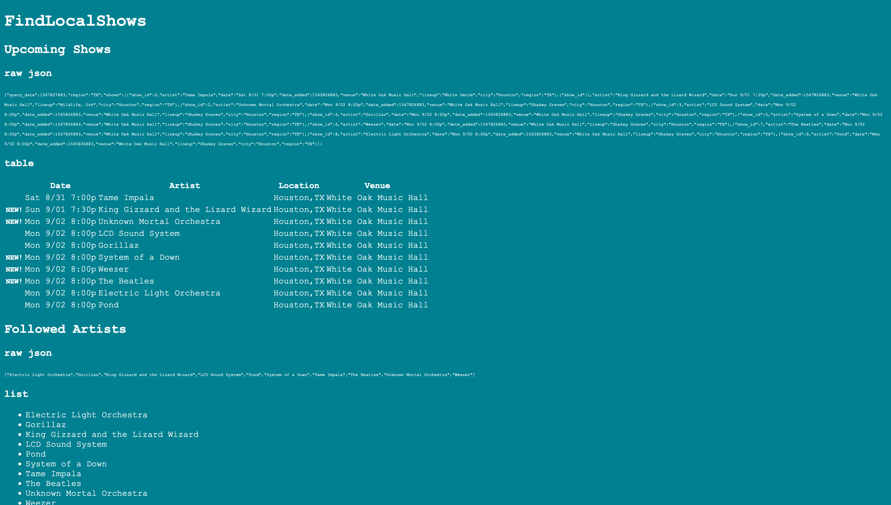

fls-basic
=========

A barebones front-end using only html/css/javascript (ES6). Used mainly for testing fls-core.

# Running

Launch fls-core in the background, make sure the javascript requests are going to the right URL, and open fls.html

# Screenshots

